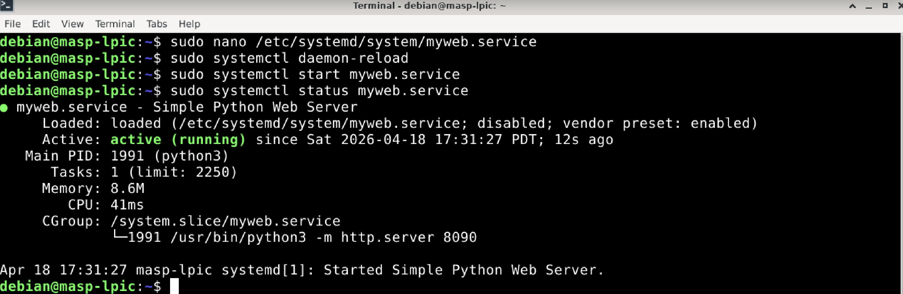
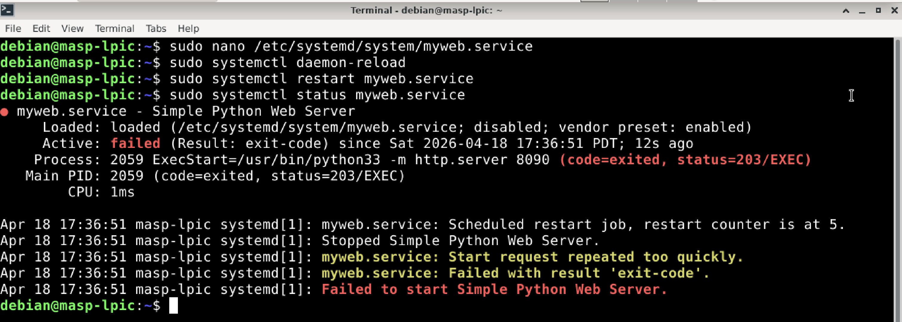

# 🧪 LAB: systemd Service Not Starting

## Overview

This lab simulates a common Linux administration issue: a systemd-managed service fails to start.

The goal is to investigate the failure, inspect service status and logs, identify the root cause, correct the problem, and validate that the service starts successfully.

---

## Scenario

A custom web service is configured to run through `systemd`, but it does not start as expected.

This is a common troubleshooting scenario in Linux system administration, infrastructure support, DevOps environments, and security-focused operations.

---

## Objectives

- Identify why the service is failing
- Inspect the service status with `systemctl`
- Analyze service logs with `journalctl`
- Fix the configuration issue
- Validate the service startup

---

## Tools Used

- `systemctl`
- `journalctl`
- `ss`
- `cat`
- `nano` or `vi`
- `python3`

---

## Lab Setup

This lab uses a simple Python HTTP server managed by `systemd`.

Create the service file:

```bash
sudo nano /etc/systemd/system/myweb.service
```

---

## Screenshots

### Initial service status


---

### Service failure after misconfiguration


---

### Error details in journalctl


---

### Service running after fix


---

### Port validation with ss

